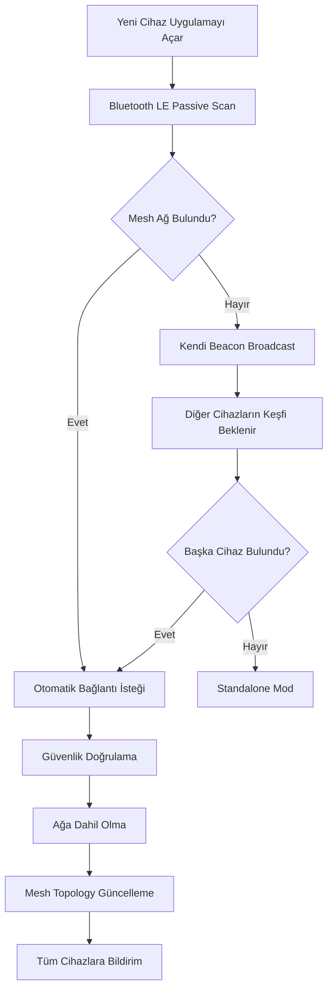

# Temel Acil Durum Ağ Stratejisi: Akıllı Adaptif Mesh Network Sistemi

## 🎯 Vizyon
Acil durumlarda kullanıcılar uygulamayı açtığında, tüm mevcut iletişim seçeneklerini otomatik olarak analiz eden, en uygun stratejiyi seçen ve dinamik olarak ağ kuran akıllı bir sistem.

---

## 🧠 Akıllı Strateji Seçim Algoritması

### 1. Uygulama Başlatma Sırası
```
Uygulama Açılır → Çevre Analizi → Strateji Seçimi → Ağ Kurulumu → Sürekli Optimizasyon
```

### 2. Çok Katmanlı Değerlendirme Sistemi

#### **Seviye 1: Altyapı Kontrol (0-5 saniye)**
- ✅ Cellular bağlantı durumu
- ✅ WiFi altyapı varlığı 
- ✅ Operatör hotspot taraması
- ✅ GPS ve konum servisleri

#### **Seviye 2: Yerel Keşif (5-15 saniye)**
- 🔍 Bluetooth LE cihaz keşfi
- 🔍 WiFi Direct capability taraması
- 🔍 Mevcut mesh ağ tespiti
- 🔍 SDR dongle varlığı (ileri kullanıcılar)

#### **Seviye 3: Kapasite Analizi (15-30 saniye)**
- 📊 Batarya durumu
- 📊 Çevredeki cihaz yoğunluğu
- 📊 RF gürültü seviyesi
- 📊 Coğrafi alan analizi

---

## 🔄 Adaptif Strateji Matrisi

### Strateji Öncelik Sıralaması:

#### **1. Optimal Durum: Hibrit Altyapı + Mesh**
- **Koşul**: Cellular/WiFi altyapı + 5+ cihaz
- **Strateji**: Carrier WiFi Bridge + Hibrit Mesh
- **Avantaj**: En yüksek kapasite ve güvenilirlik

#### **2. Kısmi Altyapı: Cascading Network**
- **Koşul**: Kısmi altyapı + 3+ cihaz
- **Strateji**: Emergency Protocol + WiFi Direct + Bluetooth
- **Avantaj**: Failover güvenliği

#### **3. Tam Bağımsız: Pure Mesh**
- **Koşul**: Altyapı yok + 2+ cihaz
- **Strateji**: WiFi Direct + Bluetooth LE Hibrit
- **Avantaj**: Tam özerklik

#### **4. Genişletilmiş Kapsamlı: SDR Enhanced**
- **Koşul**: SDR donanım + ileri kullanıcı
- **Strateji**: Tüm stratejiler + SDR frekans genişletmesi
- **Avantaj**: Maksimum esneklik

---

## 🛠️ Dinamik Ağ Kurulum Protokolü

### Faz 1: Hızlı Başlatma (0-30 saniye)
```
1. Bluetooth LE Beacon Broadcast → Hızlı keşif
2. Çevredeki emergency uygulamaları tespit
3. Temel mesh topology kurulum
4. İlk mesaj iletimi testi
```

### Faz 2: Ağ Optimizasyonu (30-60 saniye)
```
1. WiFi Direct cluster oluşturma (>3 cihaz varsa)
2. Carrier WiFi tarama ve bağlantı
3. Emergency protocol hazırlığı
4. SDR entegrasyonu (mevcutsa)
```

### Faz 3: Sürekli Adaptasyon (sürekli)
```
1. Ağ performans izleme
2. Yeni cihaz otomatik entegrasyonu
3. Başarısız bağlantılar için failover
4. Batarya optimizasyonu
```

---

## 👥 Kullanıcı Tipi Bazlı Davranış

### 🟢 Temel Kullanıcı (90%)
- **Davranış**: Tam otomatik mod
- **Strateji**: Bluetooth LE + WiFi Direct
- **Arayüz**: Basit, tek butonlu
- **Özellik**: Güç tasarrufu öncelik

### 🟡 İleri Kullanıcı (8%)
- **Davranış**: Yarı manuel kontrol
- **Strateji**: Tüm hibrit seçenekler
- **Arayüz**: Detaylı kontrol paneli
- **Özellik**: Performans optimizasyonu

### 🔴 Uzman Kullanıcı (2%)
- **Davranış**: Tam manuel kontrol
- **Strateji**: SDR + Ham Radio entegrasyonu
- **Arayüz**: Teknik parametreler
- **Özellik**: Maksimum kapsama alanı

---

## 🌐 Ağa Katılım Süreci

### Yeni Cihaz Keşfi


### Otomatik Ağ Genişletme
- **Kritik Kütle**: 10+ cihaz → WiFi Direct cluster oluşturma
- **Coğrafi Yayılma**: 500m+ mesafe → Bridge node atama
- **Kapasite Yönetimi**: Overload tespiti → Yeni cluster oluşturma

---

## ⚡ Acil Durum Senaryoları

### Scenario 1: Şehir İçi Afet
```
1. Cellular ağ çöktü, WiFi kısmen çalışıyor
2. Strateji: Carrier WiFi Bridge + Bluetooth mesh
3. Öncelik: Maksimum cihaz bağlantısı
4. Failover: Tam mesh moda geçiş
```

### Scenario 2: Kırsal Alan İzolasyonu
```
1. Tüm altyapı yok, az sayıda cihaz
2. Strateji: WiFi Direct + SDR enhancement
3. Öncelik: Maksimum menzil
4. Failover: Ham radio entegrasyonu
```

### Scenario 3: İç Mekan Sıkışma
```
1. RF parazit yüksek, çok sayıda cihaz
2. Strateji: Bluetooth LE mesh + NFC relay
3. Öncelik: Güç tasarrufu
4. Failover: Manual message relay
```

---

## 🔐 Güvenlik ve Gizlilik

### Çok Katmanlı Güvenlik
- **Katman 1**: Device fingerprinting (cihaz doğrulama)
- **Katman 2**: End-to-end encryption (AES-256)
- **Katman 3**: Mesh network integrity (dijital imza)
- **Katman 4**: Anti-jamming measures (frekans atlama)

### Gizlilik Koruması
- **Konum Anonimleştirme**: Coarse location sharing
- **Mesaj Relay**: Intermediate node'lar içerik göremez
- **Temporary Identity**: Rotating node ID'ler
- **Emergency Override**: Acil durumda tam şeffaflık

---

## 📊 Gerçek Zamanlı Performans İzleme

### Kritik Metrikler
```
- Ağ Bütünlüğü: %95+ uptime hedef
- Mesaj Teslimat: <5 saniye yerel, <30 saniye multi-hop
- Batarya Verimlilik: 6+ saat sürekli çalışma
- Yeni Cihaz Keşif: <30 saniye
- Failover Süresi: <10 saniye
```

### Otomatik Optimizasyon
- **Trafik Dengesi**: Yoğun node'larda load balancing
- **Güç Yönetimi**: Düşük batarya cihazlarda düşük güç modu
- **QoS Kontrolü**: Acil mesajlara öncelik
- **Ağ Sağlığı**: Kopuk bağlantıları otomatik onarım

---

## 🚀 Uygulama Akışı

### Kullanıcı Açısından Deneyim
```
1. [ACİL DURUM] butonu → Uygulama açılır
2. "Çevren taranıyor..." → 5-15 saniye bekleme
3. "X cihaz bulundu, ağ kuruluyor..." → Otomatik setup
4. "Ağ hazır! Mesaj gönderebilirsin" → Kullanım başlar
5. Arka planda sürekli optimizasyon devam eder
```

### Teknik Sistem Akışı
```
1. Hardware capability detection
2. Multi-strategy parallel testing
3. Performance-based strategy selection
4. Dynamic network establishment
5. Continuous monitoring & adaptation
6. Automatic failover handling
7. New device integration
8. Performance optimization
```

---

## 🎯 Stratejik Öncelikler

### Kısa Vadeli (0-6 ay)
1. **Temel Hibrit Mesh**: WiFi Direct + Bluetooth LE
2. **Otomatik Keşif**: Plug-and-play deneyim
3. **Temel Güvenlik**: End-to-end encryption

### Orta Vadeli (6-18 ay)
1. **Carrier WiFi Integration**: Operatör hotspot entegrasyonu
2. **Emergency Protocol**: Acil çağrı kanalı kullanımı
3. **Advanced UI**: Kullanıcı tipi bazlı arayüzler

### Uzun Vadeli (18+ ay)
1. **SDR Enhancement**: Gelişmiş kullanıcılar için genişletme
2. **AI Optimization**: Makine öğrenmesi ile ağ optimizasyonu
3. **IoT Integration**: Akıllı şehir sistemleri entegrasyonu

---

## 💡 Ek Öneriler

### 1. Sosyal Ağ Etkisi
- **Viral Spread**: Ağa katılan her cihaz çevresini etkiler
- **Community Building**: Mahalle bazlı mesh ağ toplulukları
- **Training Programs**: Kullanıcı eğitim programları

### 2. Donanım Ortaklıkları
- **Power Bank Integration**: USB-C güç paylaşımı
- **Mesh Router**: Evler için daimi mesh node'lar
- **Vehicle Integration**: Araç tabanlı mobil relay'ler

### 3. Kurumsal Entegrasyon
- **AFAD Koordinasyonu**: Resmi acil durum sistemleri
- **Belediye İşbirliği**: Şehir WiFi altyapısı kullanımı
- **Telecom Partnership**: Operatör düzeyinde entegrasyon

---

*Bu strateji belgesi, acil durum mesh network'ün tüm teknik bileşenlerini kullanıcı odaklı, akıllı ve adaptif bir sistemde birleştirerek, gerçek acil durumlarda maksimum etkinlik sağlamayı hedeflemektedir.*