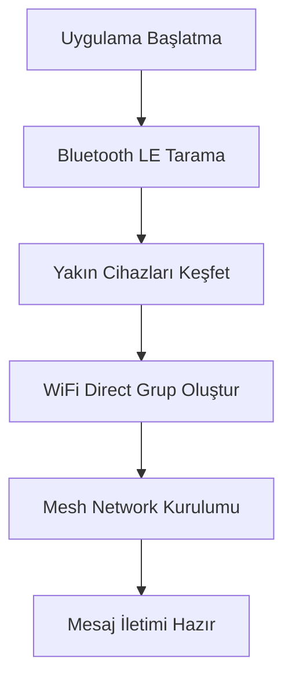
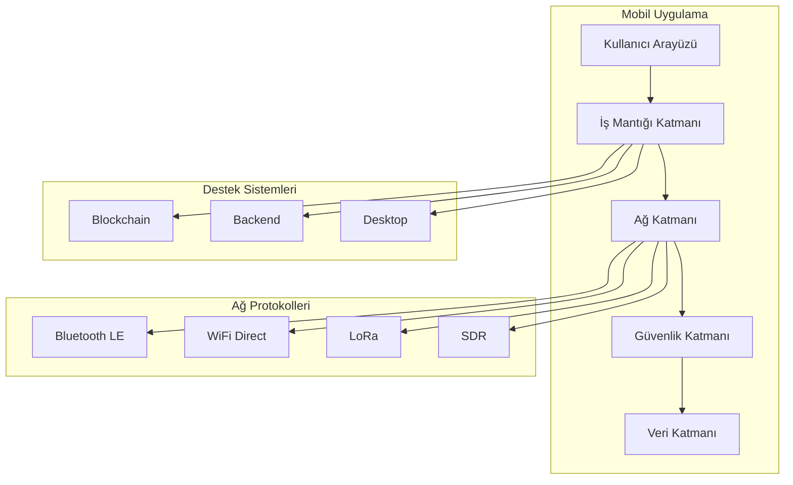
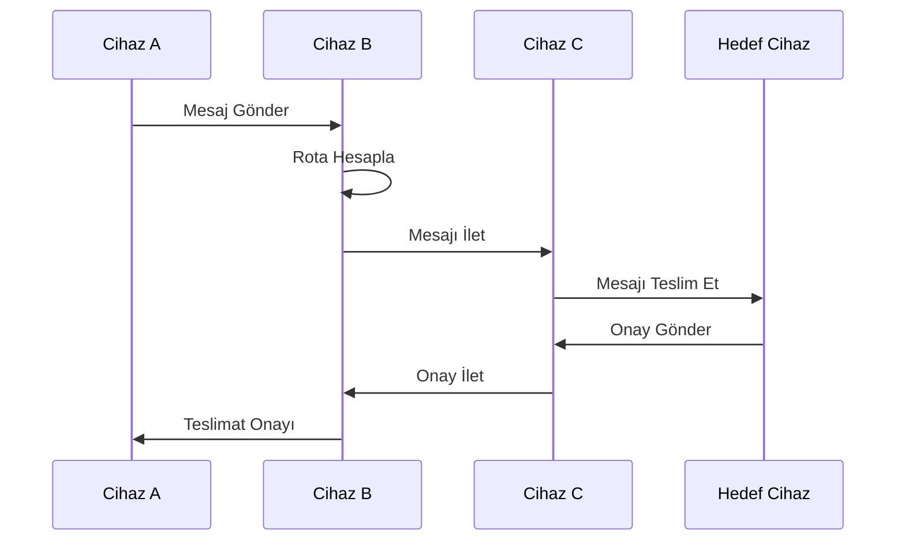
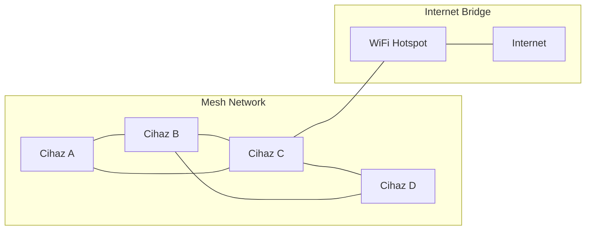

# 📱 Mobil Odaklı Acil Durum Mesh Network Geliştirme Yol Haritası

## 🎯 Genel Yaklaşım

Bu proje, **mobil-first** yaklaşımıyla geliştirilecektir. Tüm diğer bileşenler (blockchain, backend, desktop) mobil uygulamanın etrafında şekillenecek ve ona destek verecektir. Ana hedef, cep telefonlarının acil durumlarda otomatik mesh network kurmasıdır.

### 🏗️ Mimari Prensip: "Mobil Merkezi Ekosistem"

```
┌─────────────────────────────────────────────────────────────┐
│                    MOBİL UYGULAMA (ANA)                    │
│  ┌─────────────────────────────────────────────────────┐    │
│  │              ÇEKIRDEK MESH KATMANI                  │    │
│  │  • P2P Network    • Bluetooth LE   • WiFi Direct   │    │
│  │  • Mesajlaşma     • Güvenlik       • Yönlendirme   │    │
│  └─────────────────────────────────────────────────────┘    │
└─────────────────────────────────────────────────────────────┘
           │                    │                    │
    ┌──────▼──────┐    ┌────────▼────────┐    ┌──────▼──────┐
    │  Blockchain │    │  Backend        │    │  Desktop    │
    │  (Destek)   │    │  (Opsiyonel)    │    │  (Yönetim)  │
    └─────────────┘    └─────────────────┘    └─────────────┘
```

---

## 🚀 Faz 1: Temel Mobil Altyapı (0-3 Ay)

### 1.1 Proje Kurulumu ve Temel Mimari

#### 📋 Görevler:
- [ ] **Cross-platform framework seçimi** (Flutter önerisi)
- [ ] **Proje yapısı oluşturma**
- [ ] **CI/CD pipeline kurulumu**
- [ ] **Test framework'ü entegrasyonu**

#### 🏗️ Kod Yapısı:
```
mobile_mesh_app/
├── lib/
│   ├── core/                 # Çekirdek işlevsellik
│   │   ├── network/          # Ağ katmanı
│   │   ├── security/         # Güvenlik
│   │   └── storage/          # Veri depolama
│   ├── features/             # Özellik modülleri
│   │   ├── messaging/        # Mesajlaşma
│   │   ├── discovery/        # Cihaz keşfi
│   │   └── emergency/        # Acil durum
│   ├── shared/               # Paylaşılan bileşenler
│   └── main.dart
├── test/                     # Test dosyaları
├── integration_test/         # Entegrasyon testleri
└── docs/                     # Teknik dokümantasyon
```

#### 🧪 Test Stratejisi:
```dart
// Örnek test yapısı
test/
├── unit/
│   ├── core/
│   │   ├── network_test.dart
│   │   └── security_test.dart
│   └── features/
│       └── messaging_test.dart
├── widget/
│   └── ui_component_test.dart
└── integration/
    └── mesh_network_test.dart
```

### 1.2 Temel P2P Network Implementasyonu

#### 📋 Görevler:
- [ ] **Bluetooth LE keşif mekanizması**
- [ ] **WiFi Direct grup oluşturma**
- [ ] **Temel mesaj iletimi**
- [ ] **Cihaz kimlik yönetimi**

#### 💻 Kod Örneği - Temel Network Manager:
```dart
// lib/core/network/network_manager.dart
class NetworkManager {
  final BluetoothManager _bluetoothManager;
  final WiFiDirectManager _wifiDirectManager;
  
  Future<void> startDiscovery() async {
    await _bluetoothManager.startScanning();
    await _wifiDirectManager.createGroup();
  }
  
  Future<void> sendMessage(Message message) async {
    // Mesaj gönderme mantığı
  }
}
```

#### 📊 Diyagram - P2P Network Akışı:


### 1.3 Temel UI/UX Implementasyonu

#### 📋 Görevler:
- [ ] **Acil durum odaklı arayüz tasarımı**
- [ ] **Tek dokunuşla mesaj gönderme**
- [ ] **Ağ durumu göstergesi**
- [ ] **Konum paylaşımı arayüzü**

---

## 🔧 Faz 2: Gelişmiş Mesh Özellikleri (3-6 Ay)

### 2.1 Akıllı Yönlendirme Algoritması

#### 📋 Görevler:
- [ ] **Multi-hop mesaj yönlendirme**
- [ ] **Ağ topolojisi yönetimi**
- [ ] **Mesaj önceliklendirme sistemi**
- [ ] **Otomatik rota optimizasyonu**

#### 💻 Kod Örneği - Routing Manager:
```dart
// lib/core/network/routing_manager.dart
class RoutingManager {
  final Map<String, NetworkNode> _networkTopology = {};
  
  Future<List<String>> findOptimalRoute(String targetId) async {
    // Dijkstra veya A* algoritması ile rota bulma
    return _calculateShortestPath(targetId);
  }
  
  void updateTopology(NetworkNode node) {
    _networkTopology[node.id] = node;
    _recalculateRoutes();
  }
}
```

### 2.2 Güvenlik Katmanı

#### 📋 Görevler:
- [ ] **Uçtan uca şifreleme (Signal Protocol)**
- [ ] **Cihaz kimlik doğrulama**
- [ ] **Anahtar yönetimi**
- [ ] **Anti-jamming mekanizmaları**

#### 💻 Kod Örneği - Security Manager:
```dart
// lib/core/security/security_manager.dart
class SecurityManager {
  Future<EncryptedMessage> encryptMessage(String content, String recipientId) async {
    final sessionKey = await _getOrCreateSessionKey(recipientId);
    return _encryptWithChaCha20(content, sessionKey);
  }
  
  Future<String> decryptMessage(EncryptedMessage message) async {
    final sessionKey = await _getSessionKey(message.senderId);
    return _decryptWithChaCha20(message, sessionKey);
  }
}
```

### 2.3 Veri Depolama ve Senkronizasyon

#### 📋 Görevler:
- [ ] **Offline-first veri depolama**
- [ ] **Mesaj geçmişi yönetimi**
- [ ] **CRDT tabanlı senkronizasyon**
- [ ] **Veri tutarlılığı kontrolü**

---

## 🌐 Faz 3: Hibrit Network Entegrasyonu (6-9 Ay)

### 3.1 Carrier WiFi Bridge

#### 📋 Görevler:
- [ ] **Operatör WiFi hotspot tespiti**
- [ ] **Otomatik bağlantı yönetimi**
- [ ] **Internet-mesh köprü protokolü**
- [ ] **Bant genişliği optimizasyonu**

### 3.2 Emergency Protocol Exploitation

#### 📋 Görevler:
- [ ] **112/911 ELS entegrasyonu**
- [ ] **Gizli mesh sinyalleşmesi**
- [ ] **Acil durum tespiti algoritması**
- [ ] **Yasal uyumluluk kontrolleri**

### 3.3 Gelişmiş Radyo Entegrasyonu

#### 📋 Görevler:
- [ ] **LoRa modül desteği**
- [ ] **SDR dongle entegrasyonu**
- [ ] **Cognitive Radio yetenekleri**
- [ ] **Spektrum yönetimi**

---

## ⚡ Faz 4: Performans ve Optimizasyon (9-12 Ay)

### 4.1 AI Destekli Optimizasyon

#### 📋 Görevler:
- [ ] **Makine öğrenmesi tabanlı rota optimizasyonu**
- [ ] **Ağ performansı tahmini**
- [ ] **Adaptif güç yönetimi**
- [ ] **Kullanıcı davranışı analizi**

### 4.2 Blockchain Entegrasyonu

#### 📋 Görevler:
- [ ] **Emergency PoA (ePoA) konsensüs**
- [ ] **Dağıtık mesaj doğrulama**
- [ ] **Hafif blockchain node**
- [ ] **Akıllı sözleşme desteği**

---

## 🧪 Test Stratejisi ve Kalite Güvencesi

### Test Piramidi:
```
        /\
       /  \
      / UI \     ← %10 (E2E, UI Tests)
     /______\
    /        \
   /Integration\ ← %20 (Integration Tests)
  /__________\
 /            \
/  Unit Tests  \ ← %70 (Unit Tests)
/______________\
```

### Test Kategorileri:

#### 1. Unit Tests (Birim Testler)
```dart
// test/unit/core/network/routing_manager_test.dart
group('RoutingManager Tests', () {
  test('should find optimal route between nodes', () async {
    // Test implementasyonu
  });
  
  test('should handle network topology changes', () async {
    // Test implementasyonu
  });
});
```

#### 2. Integration Tests (Entegrasyon Testleri)
```dart
// integration_test/mesh_network_integration_test.dart
testWidgets('Mesh network message flow', (WidgetTester tester) async {
  // Gerçek cihazlarda mesh network testi
});
```

#### 3. Performance Tests (Performans Testleri)
- Batarya tüketimi testleri
- Bellek kullanımı analizi
- Ağ gecikmesi ölçümleri
- Mesaj iletim hızı testleri

#### 4. Security Tests (Güvenlik Testleri)
- Şifreleme/şifre çözme performansı
- Anahtar yönetimi güvenliği
- Saldırı simülasyonları
- Penetrasyon testleri

---

## 📊 Diyagramlar ve Görselleştirme

### 1. Sistem Mimarisi Diyagramı:


### 2. Mesaj Akış Diyagramı:


### 3. Ağ Topolojisi Diyagramı:


---

## 📈 Performans Metrikleri ve KPI'lar

### Temel Performans Göstergeleri:

| Metrik | Hedef | Ölçüm Yöntemi |
|--------|-------|---------------|
| Mesaj İletim Başarı Oranı | %95+ | Automated testing |
| Ortalama Gecikme | <5 saniye | Network monitoring |
| Batarya Ömrü | 6-12 saat | Power consumption tests |
| Ağ Kapsama Alanı | 500m-5km | Field testing |
| Cihaz Keşif Süresi | <30 saniye | Performance benchmarks |
| Maksimum Hop Sayısı | 10+ | Network topology analysis |

### Performans İzleme Kodu:
```dart
// lib/core/monitoring/performance_monitor.dart
class PerformanceMonitor {
  static final Map<String, Stopwatch> _timers = {};
  
  static void startTimer(String operation) {
    _timers[operation] = Stopwatch()..start();
  }
  
  static Duration endTimer(String operation) {
    final timer = _timers[operation];
    timer?.stop();
    return timer?.elapsed ?? Duration.zero;
  }
  
  static void logMetric(String metric, double value) {
    // Metrik kaydetme ve analiz
  }
}
```

---

## 🔄 Sürekli Entegrasyon ve Dağıtım (CI/CD)

### GitHub Actions Workflow:
```yaml
# .github/workflows/ci.yml
name: CI/CD Pipeline

on:
  push:
    branches: [ main, develop ]
  pull_request:
    branches: [ main ]

jobs:
  test:
    runs-on: ubuntu-latest
    steps:
      - uses: actions/checkout@v3
      - uses: subosito/flutter-action@v2
      - run: flutter pub get
      - run: flutter test
      - run: flutter test integration_test/
      
  build:
    needs: test
    runs-on: ubuntu-latest
    steps:
      - uses: actions/checkout@v3
      - uses: subosito/flutter-action@v2
      - run: flutter build apk
      - run: flutter build ios --no-codesign
```

---

## 🎯 Milestone'lar ve Teslim Tarihleri

### Faz 1 Milestone'ları:
- **M1.1** (1 ay): Temel proje kurulumu ve P2P keşif
- **M1.2** (2 ay): Bluetooth LE mesh implementasyonu
- **M1.3** (3 ay): WiFi Direct entegrasyonu ve temel UI

### Faz 2 Milestone'ları:
- **M2.1** (4 ay): Multi-hop yönlendirme
- **M2.2** (5 ay): Güvenlik katmanı implementasyonu
- **M2.3** (6 ay): Veri senkronizasyonu ve offline depolama

### Faz 3 Milestone'ları:
- **M3.1** (7 ay): Carrier WiFi bridge
- **M3.2** (8 ay): Emergency protocol entegrasyonu
- **M3.3** (9 ay): Gelişmiş radyo desteği

### Faz 4 Milestone'ları:
- **M4.1** (10 ay): AI optimizasyon
- **M4.2** (11 ay): Blockchain entegrasyonu
- **M4.3** (12 ay): Üretim hazırlığı ve deployment

---

## 🛠️ Geliştirme Araçları ve Teknolojiler

### Mobil Geliştirme Stack:
- **Framework**: Flutter 3.x
- **Dil**: Dart
- **State Management**: Riverpod/Bloc
- **Database**: Hive/SQLite
- **Network**: Dio + Custom P2P protocols
- **Testing**: Flutter Test + Mockito

### Destek Teknolojileri:
- **Backend**: Node.js/Rust (minimal)
- **Blockchain**: Custom ePoA implementation
- **Desktop**: Flutter Desktop/Electron
- **CI/CD**: GitHub Actions
- **Monitoring**: Firebase Analytics/Crashlytics

---

## 📝 Dokümantasyon Stratejisi

### Dokümantasyon Türleri:
1. **API Dokümantasyonu**: Dart doc comments
2. **Mimari Kararlar**: ADR (Architecture Decision Records)
3. **Kullanıcı Rehberleri**: Markdown dosyaları
4. **Geliştirici Rehberleri**: Code comments + Wiki
5. **Test Dokümantasyonu**: Test senaryoları ve sonuçları

### Dokümantasyon Güncellemesi:
- Her PR ile birlikte dokümantasyon güncellemesi
- Haftalık dokümantasyon review'ları
- Milestone'larda kapsamlı dokümantasyon auditi

---

## 🚨 Risk Yönetimi ve Acil Durum Planları

### Teknik Riskler:
1. **Platform Kısıtlamaları**: iOS/Android API sınırlamaları
2. **Performans Sorunları**: Batarya tüketimi, bellek kullanımı
3. **Güvenlik Zafiyetleri**: Şifreleme, kimlik doğrulama
4. **Ağ Karmaşıklığı**: Mesh routing, topoloji yönetimi

### Risk Azaltma Stratejileri:
- Erken prototipleme ve test
- Sürekli performans izleme
- Güvenlik audit'leri
- Alternatif teknoloji araştırması

---

## 🎉 Sonuç ve Başlangıç Adımları

### İlk 30 Günde Yapılacaklar:
1. **Hafta 1**: Flutter projesi kurulumu ve temel yapı
2. **Hafta 2**: Bluetooth LE keşif implementasyonu
3. **Hafta 3**: Temel mesajlaşma protokolü
4. **Hafta 4**: İlk working prototype ve testler

### Başlangıç Komutu:
```bash
# Proje oluşturma
flutter create mobile_mesh_app
cd mobile_mesh_app

# Bağımlılıklar ekleme
flutter pub add bluetooth_low_energy
flutter pub add wifi_direct
flutter pub add hive
flutter pub add riverpod

# İlk test çalıştırma
flutter test
```

Bu yol haritası, mobil-first yaklaşımıyla acil durum mesh network uygulamasının sistematik geliştirilmesi için kapsamlı bir rehber sunmaktadır. Her faz, önceki fazın üzerine inşa edilir ve sürekli test edilebilir, dağıtılabilir bir ürün ortaya çıkarır.