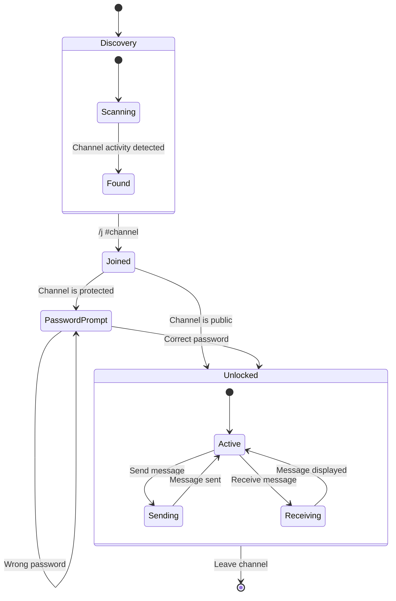

# bitchat Technical Whitepaper

## Abstract

bitchat is a decentralized, peer-to-peer messaging application that operates over Bluetooth Low Energy (BLE) mesh networks. It provides ephemeral, encrypted communication without relying on internet infrastructure, making it resilient to network outages and censorship. This whitepaper details the technical architecture, protocols, and privacy mechanisms that enable secure, decentralized communication.

## Table of Contents

1. [Introduction](#introduction)
2. [Architecture Overview](#architecture-overview)
3. [Bluetooth Mesh Network](#bluetooth-mesh-network)
4. [Message Relay Protocol](#message-relay-protocol)
5. [Store and Forward Mechanism](#store-and-forward-mechanism)
6. [Encryption and Security](#encryption-and-security)
7. [Channel-Based Communication](#channel-based-communication)
8. [Binary Protocol Specification](#binary-protocol-specification)
9. [Privacy Features](#privacy-features)
10. [Message Fragmentation](#message-fragmentation)
11. [Conclusion](#conclusion)

## Introduction

bitchat addresses the need for resilient, private communication that doesn't depend on centralized infrastructure. By leveraging Bluetooth Low Energy mesh networking, bitchat enables direct peer-to-peer messaging within physical proximity, with automatic message relay extending the effective range beyond direct Bluetooth connections.

### Key Features

- **Decentralized**: No servers, no infrastructure dependencies
- **Ephemeral**: Messages exist only in device memory by default
- **Encrypted**: End-to-end encryption for private messages
- **Resilient**: Automatic mesh networking and message relay
- **Private**: No phone numbers, emails, or permanent identifiers

## Architecture Overview

<div align="center">


</div>

## Bluetooth Mesh Network

bitchat implements a custom mesh networking protocol over BLE, where each device acts as both a central (client) and peripheral (server), enabling multi-hop message delivery.

### Network Topology

```mermaid
graph TD
    subgraph "Physical Space (e.g., Conference, Protest, Disaster Area)"
        subgraph "Zone A"
            A1["Alice\n📱"]
            A2["Bob\n📱"]
            A3["Carol\n📱"]
        end
        
        subgraph "Zone B"
            B1["Dave\n📱"]
            B2["Eve\n📱"]
            B3["Frank\n📱"]
        end
        
        subgraph "Zone C"
            C1["Grace\n📱"]
            C2["Henry\n📱"]
            C3["Iris\n📱"]
        end
    end
    
    A1 -.->|BLE| A2
    A2 -.->|BLE| A3
    A1 -.->|BLE| A3
    
    B1 -.->|BLE| B2
    B2 -.->|BLE| B3
    B1 -.->|BLE| B3
    
    C1 -.->|BLE| C2
    C2 -.->|BLE| C3
    C1 -.->|BLE| C3
    
    A3 ==>|Bridge| B1
    B3 ==>|Bridge| C1
    
    style A1 fill:#e3f2fd
    style A2 fill:#e3f2fd
    style A3 fill:#e3f2fd
    style B1 fill:#f3e5f5
    style B2 fill:#f3e5f5
    style B3 fill:#f3e5f5
    style C1 fill:#e8f5e9
    style C2 fill:#e8f5e9
    style C3 fill:#e8f5e9
```

<div align="center">



</div>

In this topology:
- **Local clusters** form based on physical proximity (≈30m range)
- **Bridge nodes** connect clusters when in overlapping range
- **Messages hop** across the network reaching distant peers
- **No infrastructure** required - completely peer-to-peer

### Peer Discovery and Connection

<div align="center">


</div>

Each device:
1. **Advertises** as a BLE peripheral with the bitchat service UUID
2. **Scans** for other devices advertising the same service
3. **Connects** to discovered peers as a central
4. **Maintains** simultaneous connections as both central and peripheral

### Connection Management

The mesh network automatically handles:
- **Connection limits**: Manages BLE connection constraints
- **Duty cycling**: Balances battery life with connectivity
- **Peer tracking**: Maintains active peer lists with RSSI values
- **Automatic reconnection**: Handles connection drops gracefully

## Message Relay Protocol

The relay protocol enables messages to reach peers beyond direct Bluetooth range through multi-hop forwarding.

### TTL-Based Routing

<div align="center">


</div>

Each message includes a Time-To-Live (TTL) field:
- **Initial TTL**: Set to 7 for maximum reach
- **Decrement**: Each relay decrements TTL by 1
- **Drop**: Messages with TTL=0 are not forwarded
- **Loop prevention**: Message IDs prevent circular routing

### Relay Decision Logic

```python
function shouldRelay(packet):
    if packet.ttl <= 0:
        return false
    if packet.messageID in processedMessages:
        return false
    if packet.recipientID == myID:
        return false  # We're the destination
    if packet.recipientID == broadcast:
        return true   # Always relay broadcasts
    return true       # Relay private messages for mesh
```

## Store and Forward Mechanism

The store-and-forward system ensures message delivery to temporarily offline peers.

### Message Caching

<div align="center">


</div>

### Delivery Flow

<div align="center">


</div>

Key features:
- **Automatic caching**: Messages cached when recipient unreachable
- **Tiered retention**: Regular (12hr) vs favorite peer (indefinite)
- **Delivery on reconnect**: Cached messages sent when peer returns
- **Duplicate prevention**: Message IDs prevent redundant delivery

## Encryption and Security

bitchat implements multiple layers of encryption for secure communication.

### Key Exchange Protocol

<div align="center">


</div>

### Encryption Layers

1. **Private Messages**: X25519 key exchange + AES-256-GCM
2. **Channel Messages**: Password-derived keys using Argon2id
3. **Digital Signatures**: Ed25519 for message authenticity

### Key Derivation for Channels

<div align="center">


</div>

## Channel-Based Communication

Channels provide topic-based group messaging with optional password protection.

### Channel State Machine

<div align="center">



</div>

### Channel Features

- **Hashtag naming**: Channels identified by #channelname
- **Password protection**: Optional encryption with shared passwords
- **Owner privileges**: Transfer ownership, change passwords
- **Message retention**: Owner-controlled mandatory retention
- **Decentralized discovery**: Channels discovered through usage

## Binary Protocol Specification

bitchat uses an efficient binary protocol to minimize bandwidth usage.

### Packet Structure

<div align="center">


</div>

### Message Types

| Type | Value | Description |
|------|-------|-------------|
| ANNOUNCE | 0x01 | Peer announcement with public key |
| KEY_EXCHANGE | 0x02 | Key exchange messages |
| LEAVE | 0x03 | Graceful disconnect |
| MESSAGE | 0x04 | Chat messages (private/broadcast) |
| FRAGMENT_START | 0x05 | Start of fragmented message |
| FRAGMENT_CONTINUE | 0x06 | Continuation fragment |
| FRAGMENT_END | 0x07 | Final fragment |
| ROOM_ANNOUNCE | 0x08 | Channel status announcement |
| ROOM_RETENTION | 0x09 | Channel retention policy |

## Performance Optimizations

### Message Compression

bitchat implements intelligent message compression to reduce bandwidth usage:

<div align="center">


</div>

The compression system:
- **LZ4 Algorithm**: Fast compression/decompression optimized for real-time use
- **Entropy detection**: Skips compression for already-compressed data
- **Threshold-based**: Only compresses messages larger than 100 bytes
- **Transparent**: Compression/decompression handled automatically

### Battery-Aware Operation

The system dynamically adjusts behavior based on battery state:

<div align="center">


</div>

Power modes affect:
- **Scan duty cycle**: How often and how long we scan for peers
- **Connection limits**: Maximum simultaneous peer connections
- **Advertising intervals**: How often we broadcast our presence
- **Message aggregation**: Batching window for outgoing messages

### Optimized Bloom Filters

For efficient duplicate message detection:
- **Bit-packed storage**: Uses UInt64 arrays for memory efficiency
- **SHA256 hashing**: High-quality hash distribution
- **Dynamic sizing**: Adapts to network size (small: 500 items, large: 5000 items)
- **Low false positive rate**: 0.01 (1%) for accurate duplicate detection

## Privacy Features

bitchat implements several privacy-enhancing mechanisms.

### Cover Traffic

<div align="center">


</div>

Cover traffic characteristics:
- **Random intervals**: 30-120 seconds between dummy messages
- **Realistic content**: Mimics actual user messages
- **Marked internally**: Identified and discarded after decryption
- **Battery aware**: Disabled when battery < 20%

### Timing Randomization

<div align="center">


</div>

This prevents timing analysis attacks by adding random delays (50-500ms) to all operations, making it impossible to correlate user actions with network traffic.

### Ephemeral Identities

- **No registration**: No account creation or phone numbers
- **Random peer IDs**: Generated fresh each session
- **Public key fingerprints**: Only persistent identifier for favorites
- **Nickname-based**: Human-readable names without permanent binding

## Message Fragmentation

Large messages are automatically fragmented for reliable transmission over BLE.

### Fragmentation Flow

```mermaid
graph TD
    O[Original Message<br/>10KB] --> F[Fragment Handler]
    
    F --> F1[Fragment 1<br/>START<br/>500 bytes]
    F --> F2[Fragment 2<br/>CONTINUE<br/>500 bytes]
    F --> F3[Fragment 3<br/>CONTINUE<br/>500 bytes]
    F --> FN[Fragment N<br/>END<br/>≤500 bytes]
    
    F1 -->|20ms delay| T1[Transmit]
    F2 -->|20ms delay| T2[Transmit]
    F3 -->|20ms delay| T3[Transmit]
    FN -->|20ms delay| TN[Transmit]
    
    T1 --> R[Reassembly Buffer]
    T2 --> R
    T3 --> R
    TN --> R
    
    R --> M[Complete Message<br/>10KB]
    
    style O fill:#bbdefb
    style M fill:#c8e6c9
    style F fill:#fff3e0
    style R fill:#f8bbd0
```

<div align="center">



</div>

### Fragment Structure

- **Fragment ID**: 8-byte identifier linking fragments
- **Sequence tracking**: START, CONTINUE, END types
- **Reliability**: Each fragment independently relayed
- **Optimization**: 20ms inter-fragment delay for BLE 5.0

## Complete Message Flow

To illustrate how all components work together, here's the complete flow of a message through the bitchat system:

<div align="center">


</div>

## Future Performance Enhancements

### WiFi Direct Transport

A planned enhancement will add WiFi Direct as an alternative transport layer:

- **100x bandwidth**: 250+ Mbps vs BLE's 1-3 Mbps  
- **Extended range**: 100-200m vs BLE's 10-30m
- **Automatic handoff**: Seamlessly switch between BLE and WiFi Direct
- **Hybrid mesh**: Some nodes BLE-only, others WiFi-capable
- **Battery-aware**: Only activate for large transfers or when charging

### Alternative Transports

Future transport options being considered:

- **Ultrasonic Communication**: 1-10 kbps through air, works when radio is jammed
- **LoRa (Long Range)**: 2-15km range for disaster scenarios
- **Transport bonding**: Use multiple simultaneously for redundancy

### Transport Protocol Interface

The planned architecture will abstract transport selection:

```swift
protocol TransportProtocol {
    var transportType: TransportType { get }
    var isAvailable: Bool { get }
    func send(_ packet: BitchatPacket, to peer: PeerID?)
}

class TransportManager {
    func sendOptimal(_ packet: BitchatPacket, to peer: PeerID?) {
        // Choose based on: message size, battery, available transports
    }
}
```

## Future Considerations: Network Bridge Extension

While bitchat is designed to operate without internet infrastructure, there are scenarios where selective network bridging could enhance its capabilities without compromising its core principles. The Nostr protocol presents a particularly interesting integration opportunity.

### Nostr as a Bridge Protocol

<div align="center">


</div>

### Integration Benefits

**1. Geographic Bridge**: Connect isolated mesh networks across distances while maintaining local peer-to-peer operation.

**2. Asynchronous Delivery**: Nostr's event-based model aligns well with bitchat's store-and-forward mechanism, enabling message delivery across time zones and sporadic connectivity.

**3. Selective Sharing**: Users could opt-in to share specific channels or conversations beyond the local mesh, maintaining privacy by default.

**4. Decentralized Architecture**: Nostr's relay model preserves bitchat's decentralization principles - no single point of failure or control.

### Implementation Approach


### Privacy Preservation

Key considerations for maintaining bitchat's privacy model:

1. **Opt-in Only**: Network bridging disabled by default, requiring explicit user consent
2. **Channel-Level Control**: Bridge permissions managed per channel, not globally
3. **Maintained Encryption**: Messages remain end-to-end encrypted when bridged
4. **Ephemeral Options**: Support for Nostr's ephemeral events (NIP-16) for temporary bridging
5. **Identity Isolation**: Generate separate Nostr keypairs unlinked to local peer identities

### Use Cases

- **Disaster Coordination**: Bridge local emergency mesh networks to coordinate broader relief efforts
- **Event Overflow**: Extend large gatherings beyond Bluetooth range while maintaining local clusters
- **Checkpoint Sync**: Periodically sync specific channels when internet is briefly available
- **Cross-Community Bridges**: Connect related but geographically separated communities

This extension would be implemented as an optional module, ensuring the core bitchat system remains fully functional without any network dependencies. Users in pure offline environments would see no change, while those with selective connectivity could benefit from enhanced reach when desired.

## Conclusion

bitchat demonstrates that secure, private messaging is possible without centralized infrastructure. By combining Bluetooth mesh networking, end-to-end encryption, and privacy-preserving protocols, bitchat provides resilient communication that works anywhere people gather, regardless of internet availability.

The system's design prioritizes:
- **User privacy**: No persistent identifiers or metadata collection
- **Resilience**: Automatic mesh networking and store-and-forward
- **Security**: Strong encryption with forward secrecy
- **Efficiency**: Binary protocols and intelligent caching
- **Simplicity**: No account creation or complex setup

As a public domain project, bitchat serves as both a practical tool and a reference implementation for decentralized, privacy-preserving communication systems.

---

*This document is released into the public domain under The Unlicense.*
